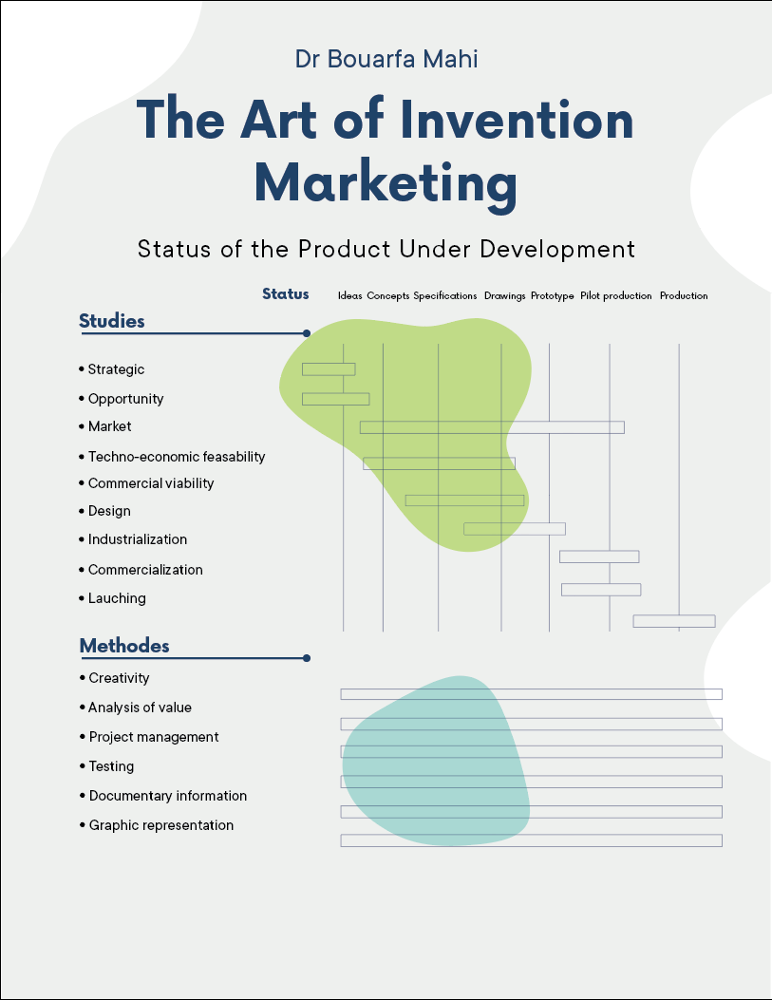
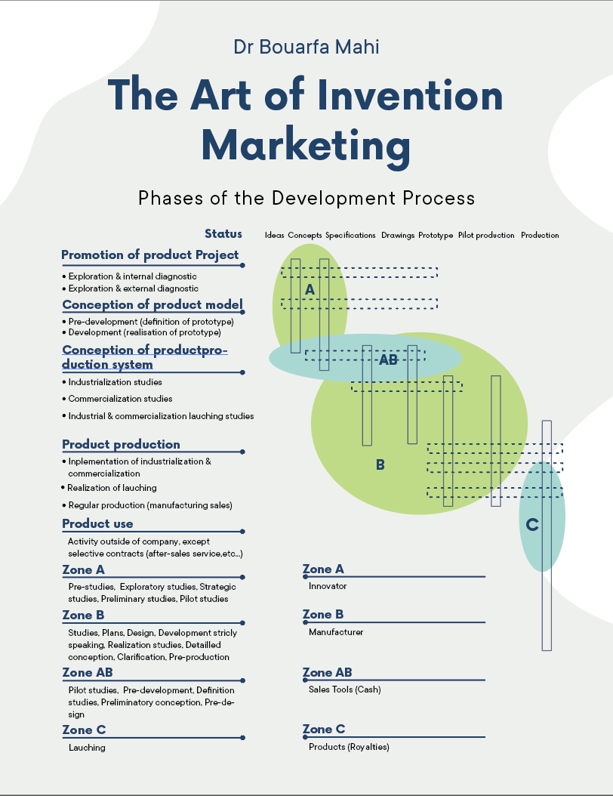

# The Art of Invention Marketing

## A Comprehensive Guide Through the Phases of the Development Process

## Preface

Faced with the daily challenges of our society, have you developed innovative solutions to technical problems or other needs? If you are seeking a company to industrialize your invention, this guide aims to help you turn your ideas into reality. It will be useful if you are looking for an opportunity to review your current situation and discover your own possibilities for improvement.

It will help you carry out your work as an innovator more efficiently, and demonstrates how to shoulder your responsibilities to overcome the inherent difficulties of launching new products.

## Introduction

It is well known that selling a new idea for a product as an intellectual property usually calls for creating a prototype to present to potential manufacturers. However, this approach presents a paradox by associating material goods with the sale of immaterial goods. The lack of a definition of the goods for sale brings this to the fore because there is no line drawn between the task of the innovator and the task assigned to the manufacturer. At present, there is no method of operation which makes it possible to eliminate this problem from the sale of intellectual property.

Research into the canvassing and sale of intellectual property, according to the marketing process, has led me to the conclusion that the pre-development of an idea is the essential working basis. This guide is the result of my research and enables us to act efficiently in the steps that we take as innovators.

## Intellectual Property

In relation to the invention or new product, intellectual property is defined in part by a collection of information to which a patent, or a design patent, or a non-disclosure agreement must be attached. These first two legal points grant the innovator property rights. From there, the innovator (A) can unequivocally transmit this collection of information to the manufacturer (B), who will then consider purchasing the intellectual property. Our marketing approach will provide insight into the nature of this collection of information and will lead us into defining the canvassing and sales tools used by the innovator.

First, it is clear that the meeting point between the innovator and the manufacturer is located during the development of the product. In analyzing the status of the product under development and the phases of the development process described in Les Techniques de l'Ingénieur in the section on Conception of Industrial Products, it is easy to put the innovator and the manufacturer into the regions (A) and (B), respectively. In order to create and transmit the collection of information from A to B, the only way is to make a path defined by the product's pre-development (AB), so that the innovator can communicate with the manufacturer.

So the important collection of information is the pre-development of the product (AB), which defines in part the intellectual property.

From another marketing standpoint - as we will see in the following paragraphs - a great deal of importance will be attached to the package of the intellectual property, in both content and form

In addition, with regards to the sale of the intellectual property, it is interesting to note that the cost of pre-development (AB) constitutes a cost price inferior to the market value of the intellectual property in terms of cash, since the Royalties are linked to the product's launching (C).

It is also necessary to define the canvassing and sales tools of the intellectual property starting from its pre-development. We have observed that the collection of information becomes clearer when we move successively from the intellectual property to the pre-development, and then to the canvassing and sales tools.

To sum up, our marketing strategy has enabled us to incorporate the complex notion of intellectual property characterized by:
-pre-development
-package
-cost price
-canvassing and sales tools

### Status of the Product under Development

1 Les Techniques de l'Ingénieur, section : Conception of Industrial Products. By courtesy of the Editor.

### Phases of the Development Process

2 Les Techniques de l'Ingénieur, section : Conception of Industrial Products. By courtesy of the Editor. I added the notes located in the lower right bottom.

## Canvassing and Sales Tools

Canvassing includes all activities with the goal of attracting potential manufacturing partners and making contact with them, either by visiting them or having them visit you. In the first approach that you make, the canvassing tools include a standard introductory letter, a product/description file and a non-disclosure agreement, which we will define later.

Sales begin once this initial contact is established. Strictly speaking, there is no sale until you are in front of a potential industrial partner, whom you are trying to persuade to purchase the intellectual property or new product.

As explained in the introduction, the greatest difficulty at this level is knowing exactly what is being sold. Indeed, we are selling neither a manufactured good, nor a provision of a service, and not even research. Rather, we are selling intellectual property. So the pre-development of the product stands out as a collection of information that partly defines the intellectual property.

Starting from the pre-development, the innovator creates a group of documents called the Innova-Book, presented in the form of a Pro-Book; also included is a communication dossier in the form of a Press-Book. So in your second approach, the sales tools consist of the Innova-Book and the Press-Book, which we will define in greater detail later.

### Canvassing Tools

The introductory letter announces the project's existence as well as its advancement, and asks the manufacturer about his or her interest in developing, manufacturing and marketing the product. It should be addressed to the Vice-President of Marketing or, if that is not possible, to the President. The product/description file positions the product on the market without revealing the invention.

The non-disclosure agreement defines the legal framework in which the information exchanges are to be carried out, and precedes the co-operation agreement. The requirements of the non-disclosure agreement invite the manufacturer to commit him or herself morally and in return we are expected to provide a high-quality of information.

#### The Introductory Letter 

Dear Sir/Madam,

I am writing to introduce a product I have pre-developed, specifically designed for industrial applications. Currently, I am seeking potential partners interested in further developing, manufacturing, and marketing this device. We are in the process of securing a patent for it. Upon your request, I am prepared to provide a detailed presentation, subject to a non-disclosure agreement.

Yours faithfully,
___________

Inventor name

#### The Product/Description 

- **Product**: Name the product according to its function.
- **Industrial applications**: Specify the industrial sectors affected by the product.
- **Principle**: Present the physical or technical principle used without revealing the invention.
- **Competition**: Outline competing technical and physical principles.
- **Advantages**: Highlight technical and economic advantages.
- **Applications**: Situate the product and its applications in relation to the intended market.
- **Potential market**: State any new features or applications and the renewal of any existing ones.
- **Marketing context**: When a device..., the proposed system is ideally adapted.
- **Licensing agreement**: Transfer or exclusive exploitation license, inventive value to cash, and percentage to be discussed, possible technical assistance (on a real expense basis with daily indemnity).

#### The Non-Disclosure Agreement

NON - DISCLOSURE AGREEMENT

This AGREEMENT, made on this _____________ day of ____________ 2024 between INVENTOR NAME, an independent inventor with address at ............., hereinafter referred to as " THE INVENTOR " and COMPANY NAME., a company with offices at …address…, hereinafter referred to as " COMPANY NAME ", both being hereinafter jointly referred to as " the Parties "

PREAMBLE

Whereas COMPANY NAME. is a United States company based in Town name, State name, which designs and manufactures …product name …for the …industrial applications… on a worldwide basis, and seeks opportunities to increase its activities in the world, either through cooperative agreements or the purchase of patents or other proprietary rights, Whereas contacts were made between the Parties and the Parties now wish to consider working together on a particular project called " product name" which is in a pre development stage and for which a patent is in process; Whereas the Parties recognize the necessity of protecting their respective proprietary rights and trade secrets, the Parties have decided first to enter in the present Non Disclosure Agreement to allow for the exchange of necessary information before then considering the opportunity for a common venture in promoting the " product name " project.

NOW THEREFORE IT IS UNDERSTOOD AND AGREED AS FOLLOWS Article 1 - SECRECY
1.1. With due regard to the achievement of the objective set in the above Preamble, the Parties hereto are willing to disclose to each other, on a strict confidential and need to know basis, certain information, including information related to the situation of their respective customers and / or competitors . 1.2 All such disclosed information is of a confidential nature, representing trade and business secrets and proprietary rights, and it shall be treated as strictly confidential and solely used to achieve the objective of the present Agreement. 1.3 Consequently both Parties agree to have their respective personnel, and personnel acting on their behalf, respect the obligation of secrecy protection relating to any information or material which they may have access to or knowledge of, during the performance of their activities under the present Agreement. Such personnel shall abstain from communicating any such information or material, under any form whatsoever, to a third party and from using it for any purpose other than that required for the due performance of that Party’s obligations hereunder. Such stipulation shall particularly concern any publicity or disclosure to any media in any form whatsoever of the considered or intended cooperation . 1.4 Unless a written consent in the form of a written amendment to the present agreement otherwise stipulates, both of the Parties hereto shall treat and protect the disclosed information in preventing its release, in any form whatsoever, to any third party including their respective customers, except as follows ( i ) to the extent such information is general or public knowledge, or which, after disclosure hereunder between the Parties, becomes general or public knowledge through no fault of either of the Parties hereto, or (i i ) to the extent such information can be shown by the concerned Party to have been legally in its possession prior to the receipt thereof hereunder, or ( i i i ) to the extent such information is received or purchased from any third party for use or disclosure without any restrictive obligation of use or disclosure to that third party. 1.5 Notice by either Party that it is no longer interested in the project upon the expiration of this Agreement, shall not relieve either party of the obligation of secrecy to which it is committed hereunder regarding the information disclosed. In case such a notification were to be served, all Confidential Information (including without limitation, documents, drawings, manuals, models and designs) furnished to COMPANY NAME by THE INVENTOR shall remain the property of THE INVENTOR and shall be returned to it promptly at its request, together with any copies thereof; also COMPANY NAME agrees not to participate in, or deal in the development of similar or comparable projects for a duration of three ( 3 ) years from the date first written above, without first obtaining the prior written consent of THE INVENTOR which consent shall not be unreasonably refused.

Article 2 - AGENDA AND ACTIONS CONSIDERED

2.1 The Parties hereto will take the following actions from the date of coming into force of the present Agreement : In a first step, they will exchange general information and prepare presentation - files to allow COMPANY NAME to gauge the interest of potential customers. The target objective in terms of time with that regard is two ( 2 ) months after the date first written above. In a second step an Agenda of Actions will be agreed upon between the Parties concerning the various approaches to be launched and followed, and the possibility of setting a cooperative arrangement . 2.2 The Parties agree to regularly keep each other informed of any response from potential customers and will try to collect any possible additional requests or observations as to their objectives, so as to have all prepared documents amended accordingly and kept up to date.

Article 3 - NO RESTRICTION OF SALE
Any indication hereunder to the contrary notwithstanding, nothing contained in the present Agreement is intended or implied to restrict or limit in any manner the sale or lease of the products to be issued or derived from the project, within the EEC .

Article 4 - NOTICES
All recommendations or requests, including approvals, comments or reasons and disagreements whether submitted by either Party, or served to each other or form or to customers, shall be made in writing, together with, whenever appropriate, suggestions for changes or modifications in order to allow and facilitate the ensuing negotiations.

Article 5 - NO WAIVER
The failure by any Party hereto, at any time, to require the performance by the other Party of any provision hereof whatsoever, shall in no way affect the right by such Party to require such performance at any time thereafter.

Article 6 - ENTIRE UNDERSTANDING
The terms and conditions of the present Agreement constitute the entire understanding of the Parties hereto, and supersede and replace all previous commitments, whether written or not, in effect between them with respect to the subject matter hereof.

Article 7 - COMING INTO FORCE - CHANGES
7.1 The present Agreement has a duration of four ( 4 ) months from the date first written above. 7.2 Neither any change, nor any modification to the present Agreement shall be binding on either Party unless set forth in a written amendment to be signed on their behalf by the accredited representatives of both Parties .

Article 8 - LITIGATIONS
All disputes arising in connection with the instant Non Disclosure Agreement shall be finally settled in accordance with the law of the state of State name. **IN WITNESS WHEREOF** the accredited representatives of the Parties have caused the present Agreement to be executed as of the date first written above.

**COMPANY NAME** &nbsp;&nbsp;&nbsp;&nbsp;&nbsp;&nbsp;&nbsp;&nbsp;&nbsp;&nbsp;&nbsp;&nbsp;**INVENTOR NAME**

**By ____________**  &nbsp;&nbsp;&nbsp;&nbsp;&nbsp;&nbsp;&nbsp;&nbsp;&nbsp;&nbsp;&nbsp;&nbsp;**By_____________**

**VP. Marketing** &nbsp;&nbsp;&nbsp;&nbsp;&nbsp;&nbsp;&nbsp;&nbsp;&nbsp;&nbsp;&nbsp;&nbsp;**Independent Inventor**

### Sales Tools

The Innova-Book presents the progression of both the product's pre-development and its applications.

Through numerous illustrations and a limited written description, the Press-Book conveys the product idea.

The Pro-Book and the Press-Book should be well presented and beautifully bound in order to enhance the value of the intellectual property. This package reflects the unfinished nature of the pre-development, so it would be worthwhile using illustrations, carefully chosen paper and fonts, and finally, technical sketches rather than technical drawings.

This natural and efficient presentation of the new project has the following consequences:

-Both qualitatively and quantitatively, it develops the idea, while at the same time enhancing its value for sales.
-It eliminates eventual objections on the part of the manufacturer
-It separates the notion of intellectual property from the notion of material good because it does not present a prototype to the manufacturer.
-It frees the manufacturer to use his or her imagination.
-It allows the innovator to measure the degree of the manufacturer's interest
-It leads the manufacturer to participate actively in the product's development when creating the prototype-that being the logical step after the pre-development.
-It enables the manufacturer to claim a part of the responsibility for the product, so that he or she does not simply become the executant.
-It brings professional credibility to the commercial approach.
-The manufacturer has everything available to make a rapid decision within the four-month maximum waiting period, without his or her having made the effort.
-It is in agreement with requirements of the non-disclosure agreement.
-It protects the idea by enhancing its value.

In order to form sales tools, it is necessary to develop scientific, technical and commercial informational sources. It is worthwhile to consult: The University Library, the City Library, the Chamber of Commerce, potential manufacturers, distributors, suppliers (components and raw materials) and subcontractors.

All this information is to be classified in the following manner:

Scientific: Comprehensible Items, ...
Technical: Components, manufacturing processes, ...
Economic: Cost of components and subcontracting,...
Commercial: Price of competing products, and markets, ...

## The Innova-Book
The Innova-Book contains the following presentation files:

### Presentation
- Title
- Features

### Idea
- Preface
- Technology & Marketing
- Product/description file

### Concept
- Principle and Design

### Specifications / Drawings
- Engineering design
- Schematic diagram of the device
- Schematic diagram of the key element
- Manufacturing processes
- Estimated manufacturing cost
- Using illustrations, validation of technology and materials
- References
- Patent search
- Design drawing of the device in an exploded view
- Applications
- Design drawing of the device, first application.
- Design drawing of the device, second application.
- Further development
- Resources for the product's development

## The Press-Book
The Press-Book contains the following presentation files:

### A type-written description:
- Technology and Marketing
- Product/Description File
- Principle and design
- Engineering design

### Drawings done by a designer:
- Design drawing of the device in an exploded view
- Design drawing of the device, first application.
- Design drawing of the device, second application.

### Using illustrations, validation of the materials and technologies:
- A color copy of a first device which functions in a comparable environment
- A color copy of a second device which functions in a comparable environment
- etc...
- A color copy of the first piece of technology used in a comparable environment
- A color copy of the second piece of technology used in a comparable environment
- A real sample of the third piece of technology if that technology does not exist in a comparable environment
- etc...

The purpose of the presentation files is to gradually move from the idea to the definition of the prototype.

## The Practical Training
The introductory letter and the product/description file should be sent to targeted companies. The targeted company should be one that enables it to develop, manufacture, and market the product. Consider the following aspects:

- Industrial sector
- Market
- Materials used
- Turnover
- Technologies used
- Investment in R & D
- Subsidiaries

Avoid companies that use your proposition to request invention funding. The usual and desirable method of financing the new product's development is self-financing drawn from the company's everyday activity. In general, it is advised to contact those companies with more than 80 and 250 employees, respectively, in the field of high technology and in more traditional sectors. Rather than contacting the leader, contact its competitors, which are more opportunist and determined. The search for manufacturers must be done in an efficient and well-organized manner; it must enable you to obtain a maximum amount of information in a minimum amount of time and cost.

In a given sector of activity:

First of all, look for a professional event, such as an exhibition, where corresponding manufacturers will display their products. Obtain the exhibitor's guide, either by buying it or studying it at the Chamber of Commerce. Read the specialized written press from the last twelve months and fill out the documentation request card. Use the internet by consulting major search engines, specialized directories such as Thomas Register and Kompass, and indicating key words related to your invention. Supplement this information by contacting product distributors.

This first approach is carried out through the Vice-President of Marketing, for he or she gives a marketing dimension to the pre-development of the new product that you are proposing. The information that he or she gives you will be useful and reliable, and will be a worthwhile supplement to the Innova-Book. Retain only qualitative information; quantitative information brings about a limit.

Never contact the Director of Research and Development, who represents a technical continuation of your proposition. A meeting with him could, however, provide a small part of a solution which you had not previously considered. The introductory letter and the product/description file should be sent by fax and the internet. A web site brings these two prospecting tools together, and should be referenced on internet search engines. In particular, key words related to your invention should be referenced.

Consider also the opportunity to place an advertisement on the specialized written press where you can submit your ideas and rough drawings. 

___

If a manufacturer contacts you, fax him or her the non-disclosure agreement and set up an appointment. 

Prior to these discussions, or ideally as early as possible in the development of your invention, consider submitting a [Provisional Patent Application](https://www.uspto.gov/patents/basics/apply/provisional-application) to the [United States Patent and Trademark Office (USPTO)](https://www.uspto.gov/). This application should include detailed descriptions and, if applicable, the most important presentation files related to your innovation

Next, sign the non-disclosure agreement with the manufacturer and present him or her the Press-Book.

The Press-Book should be compiled in Panodia's eureka style. The first page should provide a general explanation of the subject. Present the product with humility and comment in detail on the collection of information within the Press-Book. Use the strength of silence to let the manufacturer speak. This will allow you to gather reactions, which will give you an indication of the manufacturer's attitude towards the project. Ask good and open questions in order to obtain information concerning the manufacturer's situation, problems, desires, knowledge, opinion, "vision" and needs. Examples of these questions would be:

What characteristics do you expect from this product?
What results to you expect from...?
What solutions have you thought of?
How do you plan to put the development program in place?
How do you envision our future collaboration?
How can I assist you?

Listen actively and note down the responses carefully. Encourage the person with whom you are speaking to take action. The invention's value is measured by the perception of a change in the manufacturer's behaviour.

If the manufacturer is interested, have him or her date and sign each page of a photocopy of the Innova-Book. You should keep those photocopies. You should then give him the Innova-Book and look over it together. The first page of the Innova-Book should contain the company's name as well as a colour logo. In order to enhance its value, the Innova-Book should be well-presented and well-bound such as Panodia's Pro-Book. At this point, it is too early to engage in a full discussion of the contract's Cash and Royalty values.

If after two months, the manufacturer shows no interest in the project, ask him or her to return the Innova-Book. If he or she is interested in the project, request a confirmation by mail or fax. After an additional waiting period, sign a contract defined by both parties and written up by a patent attorney.

___

In general, negotiation concerns four terms linked to the intellectual property's sale:

- **Cash**
- **Royalties**
- **Technical Assistance**
- **Technology Transfer**

Technical assistance occurs during the product's development. The technology transfer takes place afterward. At first, negotiate globally, and then negotiate each of these terms separately. The writing up of the contract should be done by a patent attorney.

Try to transfer the patent rather than concede an exploitation license. This will prevent you from having to pay all the charges associated with the patent.

